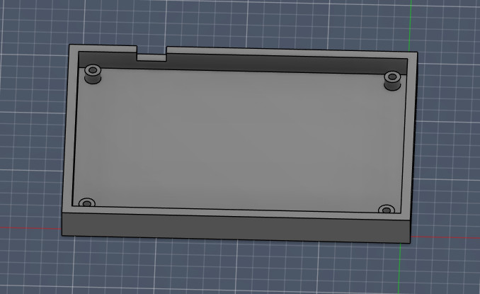

# Hack-Club-Blueprint-Hackpad
My Hackpad Design
# CopperEcho

CopperEcho is a custom 4-key macropad featuring a rotary encoder and OLED display, built around a WASD-style layout for intuitive media control.

Designed as part of a Hack Club Hackpad project, it blends functionality with aesthetics through a custom PCB, exposed copper artwork, and a compact 3D printed case.

---

## ✨ Features

- WASD-style 4 key layout
- Rotary encoder (volume + media control)
- 128x32 OLED display (song info / progress)
- Powered by XIAO microcontroller
- Custom PCB with exposed copper artwork
- Compact 3D printed case
- KMK firmware

---

## 📸 Final Build

---

## 🧱 CAD Model

The case is designed to be simple and clean, with the PCB sitting on internal standoffs and mounted using M2 screws.

- Open-top design to show off the PCB and copper art
- 3D printed base
- PCB sits close to the top for a low-profile look

---

## 🔌 Schematic

Made in KiCad.

---

## 🧠 PCB

Here’s the custom PCB design, also made in KiCad.  
It includes a ground plane, compact routing, and custom silkscreen + copper artwork.

### PCB Layout

---

## 🎵 Design Inspiration

The PCB artwork is inspired by some of my favourite music.

I incorporated visual elements influenced by album art and themes, including references to *Wish You Were Here* by Pink Floyd. The design combines silkscreen graphics with exposed copper to create contrast and make certain elements stand out.

This was a big focus of the project — turning the PCB into something not just functional, but also visually meaningful.

### Front

### Back

---

## ⚙️ Firmware Overview

This macropad uses KMK firmware.

### Controls:

- **W** → Next track  
- **S** → Previous track  
- **A** → Rewind 10 seconds  
- **D** → Fast forward 10 seconds  
- **Encoder rotate** → Volume up/down  
- **Encoder press** → Play/Pause  

The OLED is set up to display media information (e.g. track progress).

---

## 🧾 BOM

Everything needed to build this macropad:

- 4x MX Mechanical Switches  
- 4x Keycaps  
- 1x Rotary Encoder (EC11 or similar)  
- 1x 0.91" 128x32 OLED Display (SSD1306, I2C)  
- 1x XIAO Microcontroller (RP2040 or similar)  
- 1x 4-pin Header (for OLED)  
- 4x M2 Screws  
- 1x Custom PCB  
- 1x 3D Printed Case  

---

## 📁 Files

- `/pcb` → KiCad design files  
- `/production` → Gerbers, case files, firmware  
- `/firmware` → KMK code  
- `/case` → 3D models  

---

## 🧪 Manufacturing Notes

To achieve the intended visual design:

- **Black soldermask** should be used
- **ENIG (gold) finish preferred for best visual result**
- The exposed copper areas are part of the design and should not be covered  

The black soldermask combined with the exposed copper creates a strong contrast and gives the copper a gold/orange appearance.

---

## 🛠️ Notes

- The PCB includes exposed copper art for visual design  
- Ground planes are used on both sides of the board  
- The layout was designed for comfortable one-handed use  

---

## 🚀 Future Improvements

- Add RGB lighting  
- Improve OLED visuals/animations  
- Add more keys or layers  

---

## 💬 Extra

This was my first fully custom macropad project — from schematic to PCB to case.  
Definitely learned a lot (especially about routing and footprints 😅).
